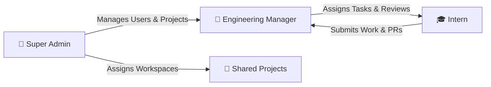

<div align="center">

# ⚡ CodeForge

### **Collaborative Engineering & Internship Management Platform with Embedded Cloud IDE & Git Automation**

[](https://reactjs.org/)
[](https://nodejs.org/)
[](https://www.mongodb.com/)
[](https://socket.io/)
[](https://docs.github.com/en/rest)
[](https://developer.stackblitz.com/)

<br />

**CodeForge** is an enterprise-grade collaborative development platform tailored for software engineering teams, bootcamps, and internship programs. It bridges the gap between project oversight and hands-on coding by combining **Role-Based Access Control (RBAC)**, **automated GitHub Git-Flow pipelines (branches, trees, and PRs)**, and a **zero-setup, browser-based Cloud IDE powered by StackBlitz WebContainer SDK**.

[Explore Features](#-key-features) • [System Architecture](#-system-architecture) • [Role Breakdown](#-role-based-workflows) • [Installation & Setup](#-getting-started) • [Default Test Accounts](#-default-test-accounts)

---

</div>

## 📌 Executive Overview

Traditional internship workflows suffer from tedious local environment setup, fragmented code review cycles, and detached progress reporting. 

**CodeForge solves this with a unified single-pane interface:**
1. **Zero-Friction In-Browser Development**: Interns write, run, and test code directly in their browser using an embedded **StackBlitz WebContainer VM** (`@stackblitz/sdk`). Code drafts synchronize bi-directionally with MongoDB Atlas and GitHub.
2. **Automated Git-Flow & GitHub Telemetry**: Automated creation of per-intern working branches (`codeforge/intern-<name>`), programmatic Git Tree commits, and one-click GitHub Pull Requests directly from the portal.
3. **Structured Governance**: Strict hierarchical workflows connecting **Super Admins**, **Engineering Managers**, and **Interns** with real-time Socket.io notifications, task boards, and daily work logs.

---

## 🏗️ System Architecture

```mermaid
flowchart TD
    subgraph Client["🖥️ Frontend (React 18 + Vite + Modern Glass Dark UI)"]
        Landing["Public Landing & Route Guards"]
        AdminView["Admin Console (User Provisioning, Project Allocations)"]
        ManagerView["Manager Dashboard (Cohort Overview, Task Assigner, Report Reviews)"]
        InternView["Intern Workspace (Tasks, Git Activity, Reports)"]
        CloudIDE["In-Browser Cloud IDE (StackBlitz WebContainer SDK & Embedded VM)"]
    end

    subgraph Server["⚙️ Backend (Node.js + Express REST API)"]
        AuthMid["JWT & RBAC Middleware"]
        Controllers["Controllers (Auth, Projects, Tasks, Reports, GitHub, Files)"]
        SocketServer["Socket.io Gateway (Live User Alerts & Task Updates)"]
        GitHubEngine["GitHub REST Engine (Git Trees, Commits, Branches & Pull Requests)"]
        CryptoService["AES-256-GCM Token Encryption"]
    end

    subgraph Data["💾 Storage & External Services"]
        MongoDB[(MongoDB Database)]
        GitHubAPI["GitHub API Cloud (REST v3)"]
        EmailService["Nodemailer SMTP Gateway"]
    end

    Client <-->|REST API + Axios| Server
    Client <-->|WebSockets (Live Push)| SocketServer
    Server <-->|Mongoose ODM| MongoDB
    Server <-->|Encrypted OAuth / PAT (Git Trees & PRs)| GitHubAPI
    Server -->|Transactional Emails| EmailService
```

---

## ✨ Key Features

### 💻 1. Embedded StackBlitz Cloud IDE
* **WebContainer Virtual Machine**: Executes Node.js environments directly in the browser using the official `@stackblitz/sdk`.
* **Zero Local Setup**: Interns can write code, run dev servers, and execute commands in terminal without installing Node or Git locally.
* **Draft Save & MongoDB Persistence**: Virtual file system snapshots are serialized (`vm.getFsSnapshot()`) and backed up to MongoDB for seamless state restoration across sessions.
* **Direct Git Commit & Push**: Changes in the virtual sandbox can be bundled into a GitHub tree commit and pushed straight to the intern's branch with one click.
* **One-Click Pull Requests**: Interns can open official GitHub Pull Requests from their workspace directly to the upstream `main` branch.

### 🐙 2. Automated Git-Flow & GitHub REST Integration
* **Auto-Branching**: Automatically spins up dedicated intern branches (`codeforge/intern-<username>`) branching off `main`.
* **Low-Level Git Tree Manipulation**: Leverages GitHub's Git Data API (`/git/trees`, `/git/commits`, `/git/refs`) to push file modifications directly via API without needing a local Git CLI.
* **Telemetry & History**: Managers and interns can monitor real-time commit logs, branches, and PR status.
* **AES-256-GCM Encryption**: Tokens and personal access credentials are encrypted at rest with AES-256-GCM.

### 👥 3. Multi-Tier Role-Based Access Control (RBAC)



| Feature / Permission | 👑 Super Admin | 👔 Manager | 🎓 Intern |
|---|:---:|:---:|:---:|
| System Metrics & Analytics | ✅ Full | 📊 Cohort Only | ❌ |
| User Provisioning & Invites | ✅ | ❌ | ❌ |
| Create & Assign Projects | ✅ | ❌ | ❌ |
| Assign Tasks & Set Milestones | ✅ | ✅ | ❌ |
| Update Task Status & Lifecycle | ❌ | ✅ | ✅ |
| Submit Daily Work Reports | ❌ | ❌ | ✅ |
| Review & Grade Intern Reports | ❌ | ✅ | ❌ |
| In-Browser StackBlitz Cloud IDE | ✅ | ✅ | ✅ |
| Inspect Supervised Git Activity | ✅ | ✅ | 🔍 Assigned Project |

### 📊 4. Task Management & Work Reporting
* **Task Board**: Real-time lifecycle tracking (`Pending` ➔ `In Progress` ➔ `Completed`) with priorities and deadlines.
* **Daily Work Reports**: Interns log daily achievements, difficulties, and next steps; managers review and sign off.
* **Visual Analytics**: Interactive performance graphs built with `Chart.js` for task throughput and cohort progress.

---

## 🛠️ Technology Stack

| Layer | Technologies |
|---|---|
| **Frontend UI** | React 18, Vite, React Router v6, Lucide Icons, Context API |
| **Cloud IDE Engine** | StackBlitz WebContainer SDK (`@stackblitz/sdk`) |
| **Styling & Charts** | Custom CSS3 Dark Glassmorphism, Chart.js, React-ChartJS-2 |
| **Backend API** | Node.js, Express.js (RESTful API architecture, MVC pattern) |
| **Database & ODM** | MongoDB, Mongoose v8 (Normalized schemas, indexing) |
| **Realtime Engine** | Socket.io (Bi-directional real-time room notifications) |
| **Git Integration** | GitHub REST API v3 (Git Trees, Commits, References, Pull Requests) |
| **Security & Auth** | JSON Web Tokens (JWT), Bcrypt.js, AES-256-GCM Encryption, CORS |
| **Mailer** | Nodemailer (Password resets, onboarding invitations) |

---

## 🚀 Getting Started

### Prerequisites
* **Node.js**: v18.0.0 or higher
* **npm**: v9.0.0 or higher
* **MongoDB**: Local MongoDB instance (`mongodb://localhost:27017`) or MongoDB Atlas URI

---

### 1. Clone the Repository
```bash
git clone https://github.com/sai1733/CodeForge.git
cd CodeForge
```

### 2. Backend Setup
```bash
cd backend
npm install
```

Create a `.env` file in the `backend` directory (or duplicate `.env.example`):
```env
PORT=5000
MONGODB_URI=mongodb://localhost:27017/codeforge
JWT_SECRET=super_secret_jwt_key_change_me_in_production
NODE_ENV=development

# Optional Mailer Config (for password resets & invites)
EMAIL_SERVICE=gmail
EMAIL_USER=your_email@gmail.com
EMAIL_PASSWORD=your_app_password

# Optional GitHub Integration
GITHUB_CLIENT_ID=your_github_client_id
GITHUB_CLIENT_SECRET=your_github_client_secret
GITHUB_CALLBACK_URL=http://localhost:5000/api/github/callback
GITHUB_TOKEN_ENCRYPTION_KEY=your_token_encryption_key_at_least_32_bytes
```

Seed initial administrative users and test accounts:
```bash
node clearAndSeed.js
```

Start the backend development server:
```bash
npm run dev
```
> Server boots up on **`http://localhost:5000`**.

---

### 3. Frontend Setup
Open a second terminal window:
```bash
cd frontend
npm install
```

Create a `.env` file in the `frontend` directory (or duplicate `.env.example`):
```env
VITE_API_URL=http://localhost:5000
```

Start the Vite development server:
```bash
npm run dev
```
> Open your browser and navigate to **`http://localhost:5173`**.

---

## 🧪 Default Test Accounts

When you run `node clearAndSeed.js` (or `npm run seed`), the database is populated with the following pre-configured credentials:

| Role | Email | Default Password | Scope |
|---|---|---|---|
| **Super Admin** | `admin@gmail.com` | `Test@123` | Global Administration |
| **Admin 1** | `admin1@gmail.com` | `Test@123` | Secondary Admin |
| **Manager 1** | `manager1@gmail.com` | `Test@123` | Project & Intern Supervision |
| **Manager 2** | `manager2@gmail.com` | `Test@123` | Project & Intern Supervision |
| **Intern 1** | `intern1@gmail.com` | `Test@123` | Assigned Tasks & Cloud IDE |
| **Intern 2** | `intern2@gmail.com` | `Test@123` | Assigned Tasks & Cloud IDE |

---

## 📁 Repository Directory Structure

```text
CodeForge/
├── backend/
│   ├── src/
│   │   ├── config/          # Database, Socket.io, and Mailer initializers
│   │   ├── controllers/     # Business logic (Auth, Tasks, Projects, GitHub, etc.)
│   │   ├── middleware/      # JWT verification, Role authorization, Validation
│   │   ├── models/          # Mongoose Schemas (User, Project, Task, Report, etc.)
│   │   ├── routes/          # Express REST endpoint declarations
│   │   ├── utils/           # Encryption helpers, Token generators, Seed logic
│   │   ├── app.js           # Express app setup and middleware configuration
│   │   └── server.js        # HTTP & Socket.io server entrypoint
│   ├── clearAndSeed.js      # Complete clean-and-seed database utility
│   ├── .env.example
│   └── package.json
│
├── frontend/
│   ├── src/
│   │   ├── api/             # Axios client instances and endpoint contracts
│   │   ├── components/      # Common UI, Task boards, Git panels
│   │   ├── context/         # AuthContext, ProjectContext, TaskContext, Sockets
│   │   ├── hooks/           # Custom React hooks
│   │   ├── pages/
│   │   │   ├── admin/       # Super Admin dashboard, User & Project managers
│   │   │   ├── auth/        # Login, Register, Invite acceptance, Password reset
│   │   │   ├── intern/      # Intern Dashboard, StackBlitz Cloud IDE, Task boards, Reports
│   │   │   ├── manager/     # Manager Dashboard, Task assigner, Report reviews
│   │   │   └── public/      # Landing page, Product presentation
│   │   ├── routes/          # ProtectedRoute guards and application router
│   │   ├── styles/          # Global theme definitions and design tokens
│   │   ├── App.jsx          # Root component
│   │   └── main.jsx         # Application entry
│   ├── .env.example
│   └── package.json
│
├── FULL_TESTING_GUIDE.md    # Complete end-to-end QA manual testing book
├── .gitignore               # Strict exclusion of secrets and dependencies
└── README.md                # Project documentation and visual portfolio guide
```

---

## 🛡️ Security Highlights

- **Stateless Authentication**: High-entropy JWT tokens with fine-grained expiration times.
- **Role-Based Guards (RBAC)**: Backend route gates and frontend React route wrappers preventing privilege escalation.
- **Crypto Protection**: GitHub tokens and secrets are encrypted using **AES-256-GCM** before persistence in MongoDB.
- **Safe Sanitization**: Protected against SQL/NoSQL injection queries and strict CORS policies.

---

## 👨‍💻 Author & Contact

**Sai Sonawane**
* **GitHub**: [@sai1733](https://github.com/sai1733)
* **Email**: [saisonawane108@gmail.com](mailto:saisonawane108@gmail.com)

---

<div align="center">
  <sub>Built with ❤️ for scalable software engineering teams and student mentorship programs.</sub>
</div>
