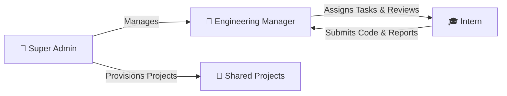

<div align="center">

# ⚡ CodeForge

### **Collaborative Engineering & Internship Management Platform with In-Browser Cloud IDE**

[](https://reactjs.org/)
[](https://nodejs.org/)
[](https://www.mongodb.com/)
[](https://socket.io/)
[](https://docs.github.com/en/rest)
[](https://microsoft.github.io/monaco-editor/)

<br />

**CodeForge** is an enterprise-grade collaborative development platform tailored for software engineering teams, bootcamps, and internship programs. It bridges the gap between project oversight and hands-on coding by combining **Role-Based Access Control (RBAC)**, **live GitHub repository telemetry**, and a **zero-setup, browser-based Cloud IDE with Monaco editor & WebContainer execution**.

[Explore Features](#-key-features) • [System Architecture](#-system-architecture) • [Role Breakdown](#-role-based-workflows) • [Installation & Setup](#-getting-started) • [API & Sockets](#-technical-highlights)

---

</div>

## 📌 Executive Overview

Traditional internship workflows suffer from tedious local environment setup, fragmented code review cycles, and detached progress reporting. 

**CodeForge solves this with a unified single-pane interface:**
1. **Zero-Friction Onboarding**: Interns write, debug, and execute code directly in their browser using an in-house **Cloud IDE** powered by Microsoft Monaco Editor & WebContainers.
2. **Deep GitHub Telemetry**: Real-time inspection of Git commits, branch diffs, and pull requests directly from supervised project repos via GitHub REST API integrations.
3. **Structured Governance**: Strict hierarchical workflows connecting **Super Admins**, **Engineering Managers**, and **Interns** with real-time notifications, task boards, and daily work logs.

---

## 🏗️ System Architecture

```mermaid
flowchart TD
    subgraph Client["🖥️ Frontend (React 18 + Vite + Tailwind/Modern Dark UI)"]
        Landing["Public Landing & Auth Guard"]
        AdminView["Admin Console (Metrics, Users, Projects)"]
        ManagerView["Manager Dashboard (Cohort, Tasks, Daily Reports)"]
        InternView["Intern Workspace (Tasks, GitHub Activity)"]
        CloudIDE["In-Browser Cloud IDE (Monaco + Terminal + File Explorer)"]
    end

    subgraph Server["⚙️ Backend (Node.js + Express REST API)"]
        AuthMid["JWT & RBAC Middleware"]
        Controllers["Controllers (Auth, Projects, Tasks, Reports, Analytics)"]
        SocketServer["Socket.io Gateway (Live Task & Alert Events)"]
        GitHubService["GitHub API Service (Commits, Branches, PRs, Webhooks)"]
        CryptoService["AES-256 GCM Token Encryption"]
    end

    subgraph Data["💾 Storage & External Services"]
        MongoDB[(MongoDB Atlas / Local DB)]
        GitHubAPI["GitHub API Cloud"]
        EmailService["Nodemailer SMTP Gateway"]
    end

    Client <-->|REST API + Axios| Server
    Client <-->|WebSockets (Live Push)| SocketServer
    Server <-->|Mongoose ODM| MongoDB
    Server <-->|Encrypted OAuth / PAT| GitHubAPI
    Server -->|Transactional Emails| EmailService
```

---

## ✨ Key Features

### 💻 1. In-Browser Cloud IDE
* **Monaco Editor Integration**: VS Code-grade code editing with syntax highlighting, IntelliSense, auto-indentation, and multi-file tabs.
* **Full File Tree Explorer**: Create, rename, edit, and organize files dynamically in an isolated virtual workspace.
* **Terminal & Runtime Engine**: Integrated browser-based runtime shell using `@webcontainer/api` and `xterm.js` for instant testing without local runtime dependencies.
* **Theme Switching**: Seamless toggle between Dark, Light, and High-Contrast development themes.

### 🐙 2. Live GitHub Repository Telemetry
* **Automated Sync**: Connect any project repository URL to fetch and monitor repository health.
* **Granular Commit & PR Tracking**: Managers and interns can view commit histories, branches, and pull requests directly from the portal.
* **AES-256 Token Encryption**: GitHub Personal Access Tokens and OAuth secrets are safely encrypted before being stored at rest.

### 👥 3. Multi-Tier Role-Based Access Control (RBAC)



| Feature / Permission | 👑 Super Admin | 👔 Manager | 🎓 Intern |
|---|:---:|:---:|:---:|
| System Metrics & Analytics | ✅ Full | 📊 Cohort Only | ❌ |
| User Provisioning & Invites | ✅ | ❌ | ❌ |
| Create & Assign Workspaces | ✅ | ❌ | ❌ |
| Assign Tasks & Set Milestones | ✅ | ✅ | ❌ |
| Update Task Status & Submit Work | ❌ | ✅ | ✅ |
| Submit Daily Work Reports | ❌ | ❌ | ✅ |
| Grade & Review Intern Reports | ❌ | ✅ | ❌ |
| Launch In-Browser Cloud IDE | ✅ | ✅ | ✅ |
| Inspect Supervised Git Activity | ✅ | ✅ | 🔍 Assigned Project |

### 📊 4. Productivity & Milestone Tracking
* **Task Board**: Real-time lifecycle management (`Pending` ➔ `In Progress` ➔ `Completed`) with priorities and deadlines.
* **Daily Work Reports**: Interns submit end-of-day summaries with blockers and accomplishments; managers review, provide feedback, and sign off.
* **Analytics Engine**: Visual metrics rendered using `Chart.js` for system throughput, task completion velocities, and active intern engagement.

---

## 🛠️ Technology Stack

| Layer | Technologies |
|---|---|
| **Frontend UI** | React 18, Vite, React Router v6, Lucide Icons, Context API |
| **Code Editor & Shell** | Microsoft Monaco Editor (`@monaco-editor/react`), Xterm.js, WebContainers |
| **Styling & Charts** | Custom Modern CSS3 Design System, Chart.js, React-ChartJS-2 |
| **Backend API** | Node.js, Express.js (RESTful API architecture, MVC pattern) |
| **Database & ODM** | MongoDB, Mongoose v8 (Normalized relationships, indexing) |
| **Realtime Engine** | Socket.io (Bi-directional real-time task notifications) |
| **Security & Auth** | JSON Web Tokens (JWT), Bcrypt.js, AES-256-GCM Crypto, Helmet, CORS |
| **Mailer** | Nodemailer (Password resets, onboarding invitations) |

---

## 🚀 Getting Started

### Prerequisites
* **Node.js**: v18.0.0 or higher
* **npm**: v9.0.0 or higher
* **MongoDB**: Local MongoDB instance running on `mongodb://localhost:27017` or MongoDB Atlas URI

---

### 1. Clone the Repository
```bash
git clone https://github.com/sai1733/CodeForge.git
cd CodeForge
```

### 2. Backend Setup
```bash
cd backend
npm install
```

Create a `.env` file in the `backend` directory (or duplicate `.env.example`):
```env
PORT=5000
MONGODB_URI=mongodb://localhost:27017/codeforge
JWT_SECRET=your_super_secret_jwt_key
NODE_ENV=development

# Optional Mailer Config (for password resets & invites)
EMAIL_SERVICE=gmail
EMAIL_USER=your_email@gmail.com
EMAIL_PASSWORD=your_app_password

# Optional GitHub Integration
GITHUB_CLIENT_ID=your_github_client_id
GITHUB_CLIENT_SECRET=your_github_client_secret
GITHUB_CALLBACK_URL=http://localhost:5000/api/github/callback
GITHUB_TOKEN_ENCRYPTION_KEY=32_bytes_random_hex_encryption_key
```

Seed initial administrative users and test workspaces:
```bash
npm run seed
```

Start the backend development server:
```bash
npm run dev
```
> Server will boot up on **`http://localhost:5000`**.

---

### 3. Frontend Setup
Open a second terminal window:
```bash
cd frontend
npm install
```

Create a `.env` file in the `frontend` directory (or duplicate `.env.example`):
```env
VITE_API_URL=http://localhost:5000
```

Start the Vite development server:
```bash
npm run dev
```
> Open your browser and navigate to **`http://localhost:5173`**.

---

## 🧪 Default Test Accounts

When you run `npm run seed` in the backend, the following pre-configured user credentials become immediately available:

| Role | Email | Password | Scope |
|---|---|---|---|
| **Super Admin** | `admin@gmail.com` | `password123` | Global Administration |
| **Manager** | `manager1@gmail.com` | `password123` | Project & Intern Supervision |
| **Intern 1** | `intern1@gmail.com` | `password123` | Assigned Tasks & Cloud IDE |
| **Intern 2** | `intern2@gmail.com` | `password123` | Assigned Tasks & Cloud IDE |

---

## 📁 Repository Directory Structure

```text
CodeForge/
├── backend/
│   ├── src/
│   │   ├── config/          # Database, Socket.io, and Mailer initializers
│   │   ├── controllers/     # Business logic (Auth, Tasks, Projects, GitHub, etc.)
│   │   ├── middleware/      # JWT verification, Role authorization, Validation
│   │   ├── models/          # Mongoose Schemas (User, Project, Task, Report, etc.)
│   │   ├── routes/          # Express REST endpoint declarations
│   │   ├── utils/           # Encryption helpers, Token generators, Seed script
│   │   ├── app.js           # Express app setup and middleware configuration
│   │   └── server.js        # HTTP & Socket.io server entrypoint
│   ├── .env.example
│   └── package.json
│
├── frontend/
│   ├── src/
│   │   ├── api/             # Axios client instances and endpoint contracts
│   │   ├── components/      # Common UI, IDE components, Task boards, Git panels
│   │   ├── context/         # AuthContext, ProjectContext, TaskContext, Sockets
│   │   ├── hooks/           # Custom React hooks
│   │   ├── pages/
│   │   │   ├── admin/       # Super Admin dashboard, User & Project managers
│   │   │   ├── auth/        # Login, Register, Invite acceptance, Password reset
│   │   │   ├── intern/      # Intern Dashboard, Cloud IDE, Task boards, Reports
│   │   │   ├── manager/     # Manager Dashboard, Task assigner, Report reviews
│   │   │   └── public/      # Landing page, Product presentation
│   │   ├── routes/          # ProtectedRoute guards and application router
│   │   ├── styles/          # Global theme definitions and design tokens
│   │   ├── App.jsx          # Root component
│   │   └── main.jsx         # Application entry
│   ├── .env.example
│   └── package.json
│
├── FULL_TESTING_GUIDE.md    # Complete end-to-end testing and QA test book
├── .gitignore               # Strict exclusion of secrets and dependencies
└── README.md                # Project documentation and visual portfolio guide
```

---

## 🛡️ Security Highlights

- **Stateless Authentication**: High-entropy JWT tokens with fine-grained expiration times.
- **Role-Based Guards (RBAC)**: Backend route gates and frontend React route wrappers preventing privilege escalation.
- **Crypto Protection**: Secret tokens and third-party credentials encrypted using **AES-256-GCM** before persistence in MongoDB.
- **Safe Sanitization**: Protected against SQL/NoSQL injection queries and strict CORS policies.

---

## 👨‍💻 Author & Contact

**Sai Sonawane**
* **GitHub**: [@sai1733](https://github.com/sai1733)
* **Email**: [saisonawane108@gmail.com](mailto:saisonawane108@gmail.com)

---

<div align="center">
  <sub>Built with ❤️ for scalable software engineering teams and student mentorship programs.</sub>
</div>
